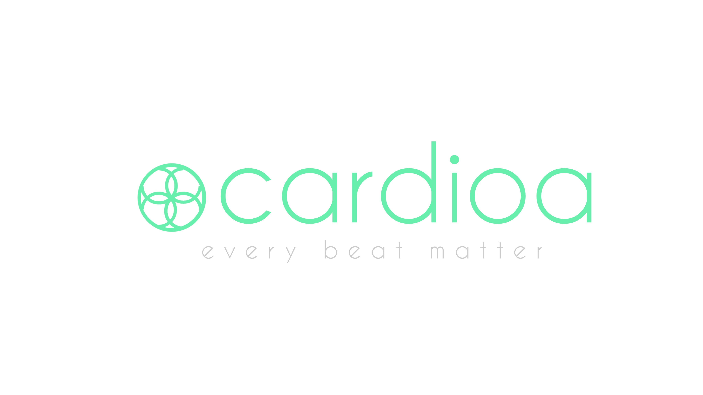
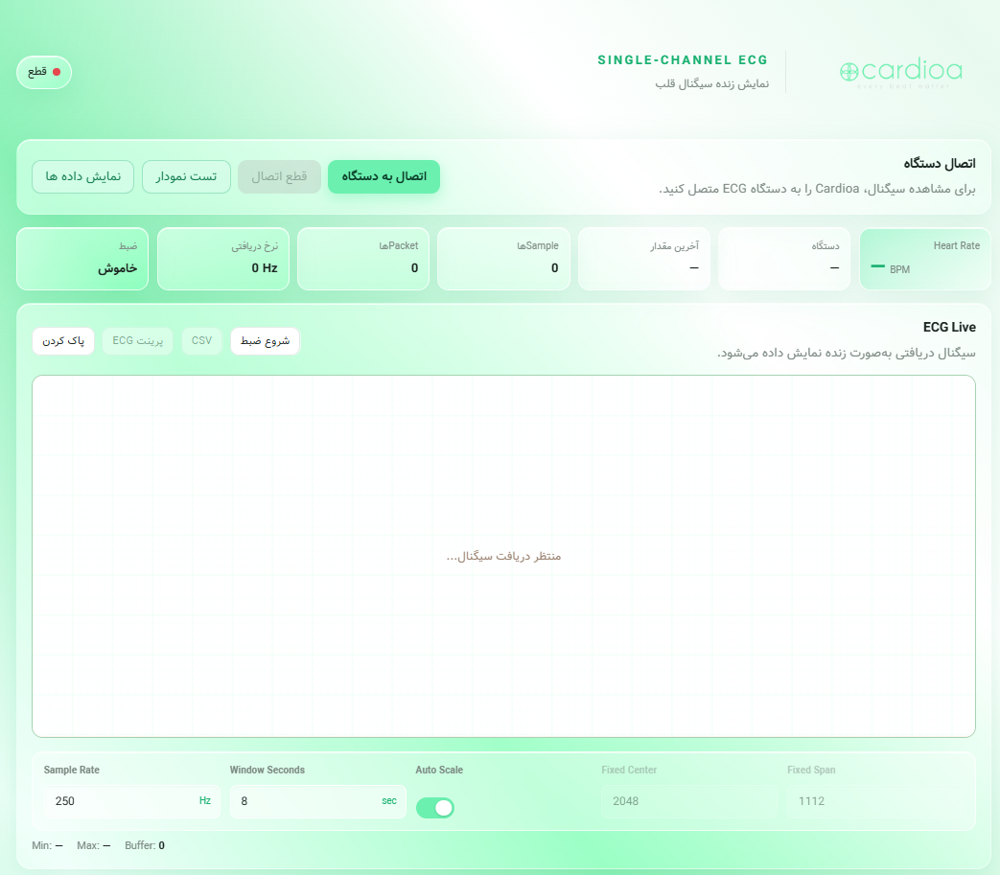
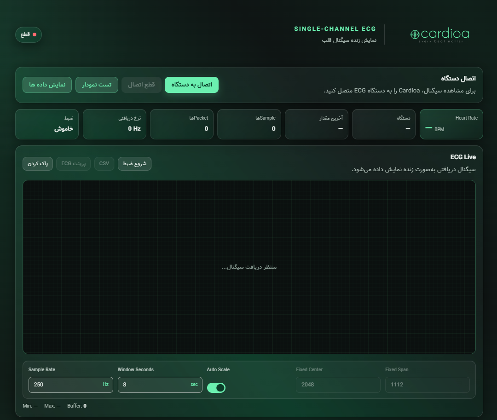

# Cardioa ECG Monitor

**Live single-channel ECG in your browser, streamed over Bluetooth Low Energy.**

---

## 📸 Screenshots

<table>
  <tr>
    <th align="center">☀️ Light theme</th>
    <th align="center">🌙 Dark theme</th>
  </tr>
  <tr>
    <td></td>
    <td></td>
  </tr>
</table>

> The interface is in **Persian (right-to-left)**, with English labels for technical terms. Both themes share the same mint brand color.

---

Cardioa ECG Monitor

